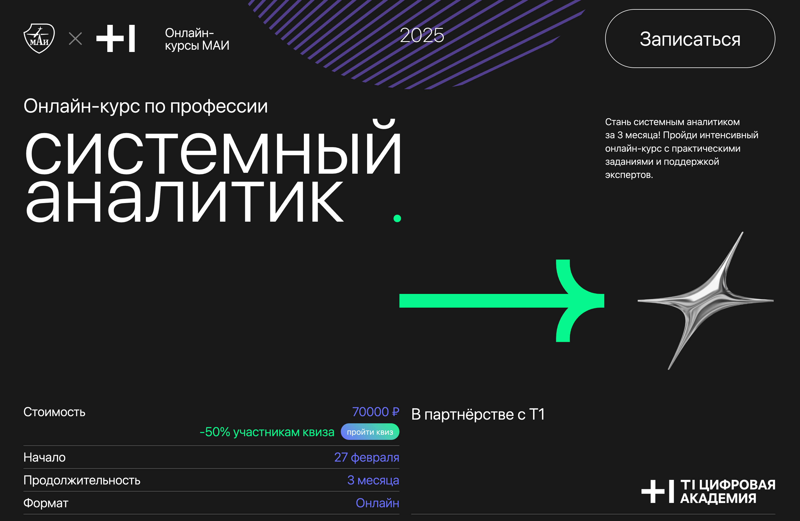
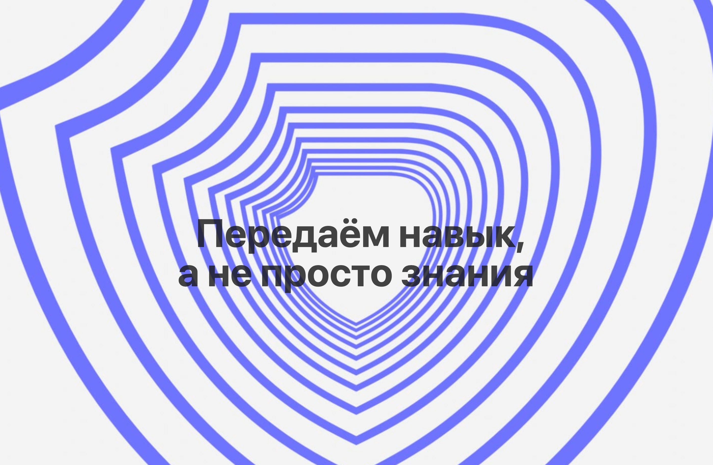

<!-- README LOGO -->
<br />
<div align="center">
  <h1 align="center">Системный аналитик</h1>
</div>

<div align="center">
  
  
</div>

---

## Руководство по работе с проектом

Данный проект создан c использованием browser-sync. https://www.npmjs.com/package/browser-sync 

## Структура проекта

_Не удаляйте и не изменяйте файлы:_
_`package.json` и `все файлы с именем, начинающимся на .`._

### src

В директории размещаются исходный код проекта: js и стили sass. Структура директории `src` может быть произвольной.

## Сценарии

После создания проекта вам доступны следующие сценарии. Обратите внимание, для запуска сценария, вы должны находится в директории проекта.

### Инициализация проекта

Перед началом работы с проектом, необходимо установить все зависимости, все пакеты и библиотеки, которые используются в проекте. Для этого используйте команду:

```bash
npm install
```
### Запуск проекта

```bash
npm run dev
```

После запуска, приложение доступно для просмотра в браузере по адресу [http://localhost:3000](http://localhost:3000).

При сохранении изменений, проект перезапускается и обновляется в браузере. Таким образом, вы можете следить за разработкой проекта в режиме реального времени.

### Сборка проекта

```bash
npm run build
```

Запуск сборки приложения.

В процессе сборки приложения, код приложения оптимизируется и минимизируется, для достижения наилучшей производительности.

Во время выполнения инструкций по сборке проекта, в корне проекта создается директория `dist`, в которую будет помещен результирующий html файл. После сборки проект готов к публикации, возможно потребуется изменить немного пути в src и href к директории assets. При деплое нужно выложить также и папку assets в которой лежат стили, шрифты, изображения и т.д.

### Ссылка на макет лендинга в Figma
https://www.figma.com/design/YDvaGGDYKwLy1WjEmsunce/sprintuniversity.ru?node-id=677-42&p=f&t=ecLWijZlPZomHTMa-0